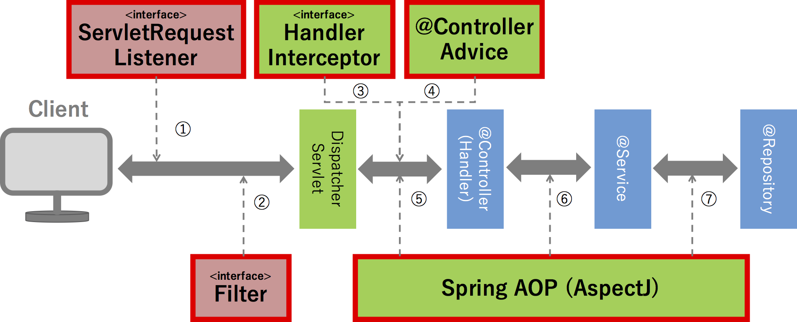

## Java Spring-boot開発準備

- [Java](http://www.oracle.com/technetwork/java/javase/downloads/index.html) - Java 8

- [IntelliJ IDEA](https://www.jetbrains.com/idea/download/) - IntelliJ IDEA 15

##### WEBUI 素材

- [AdminLTE](https://almsaeedstudio.com/) - AdminLTE

- [Font Awesome Icons](http://fortawesome.github.io/Font-Awesome/) - Font Awesome Icons

- [Ionicons](http://ionicons.com/) - Ionicons

- [js](http://www.jsdelivr.com/) - js lib

~~~
  html5shiv.js →IE対応
  respond.min.js → IE6～8でCSS3 Media Queries（max-widthとmin-width）を解釈可能
~~~

## システム全体像

- ・フレームワーク：Spring Boot
- ・実行環境：開発中は組込みTomcat。本番運用はTomcat8
- ・プレゼンテーション層：Thymeleaf。
- ・言語：Java SE 8
- ・運用時はHTTPS通信を行う想定
- ・フロント: Apache2.2
- ・開発環境：IntelliJ IDEA   
    Spring Boot + Thymeleaf + Tomcat + Gradle   

---

## 開発

- [gradle](https://gradle.org/) - Java（JVM）環境におけるビルドシステム

- [mybatis-3](https://github.com/mybatis/mybatis-3) - mybatis-3

#### ログ出力

- [Logback](https://github.com/mybatis/mybatis-3) - Logback
   compile('org.slf4j:slf4j-api:1.7.21')

compile('org.slf4j:slf4j-api:1.7.21')
- logback.xml

- 画像表示テスト

